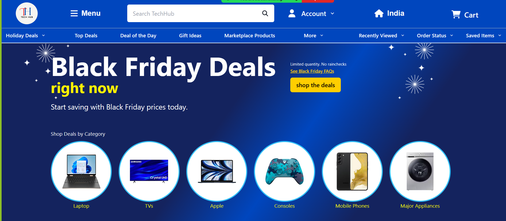
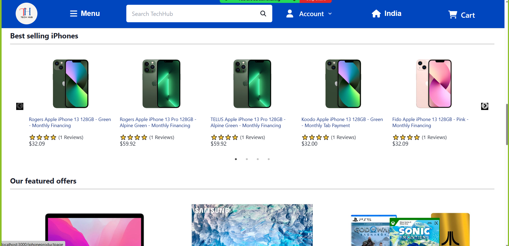
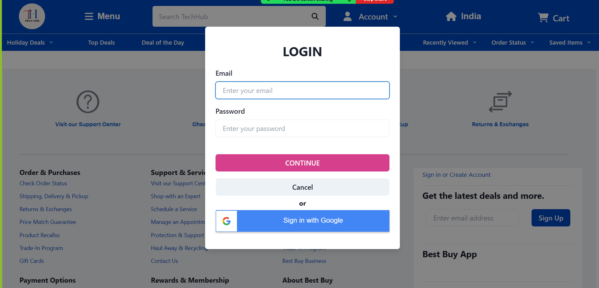
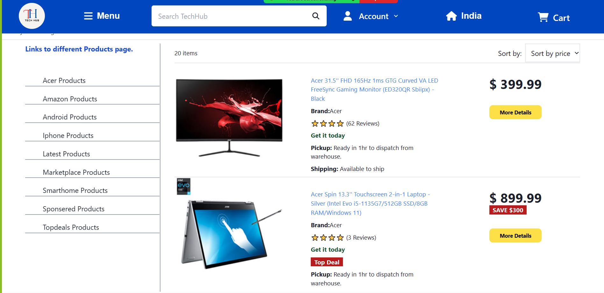
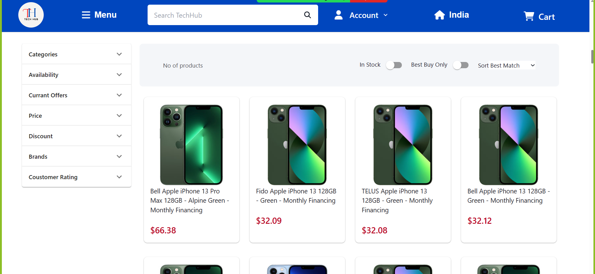
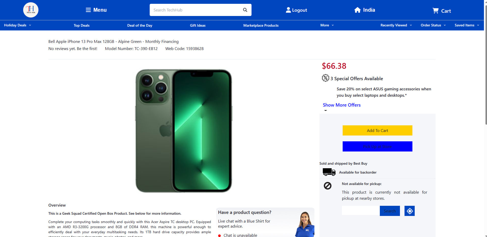
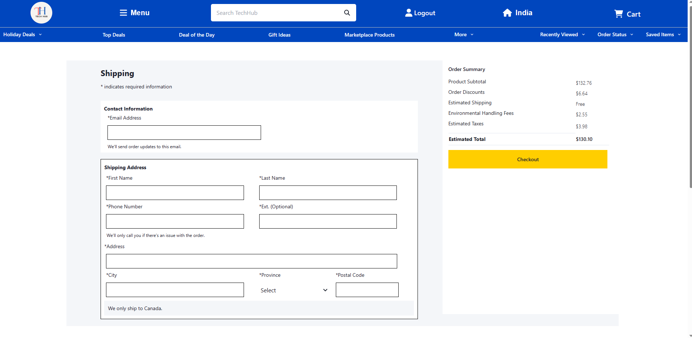
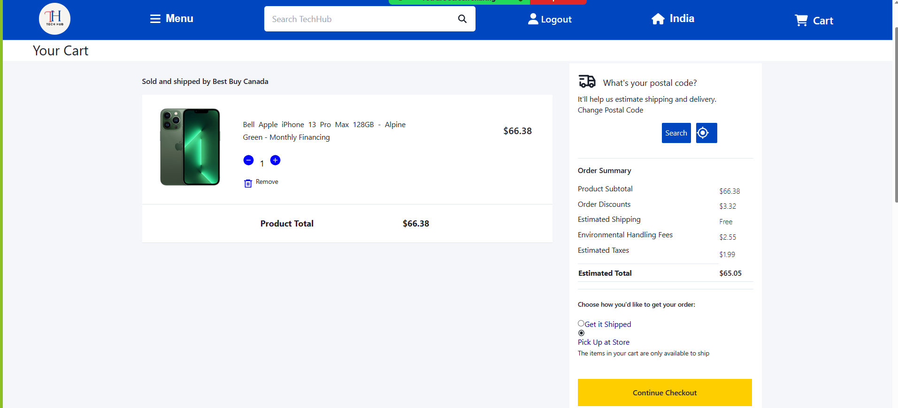
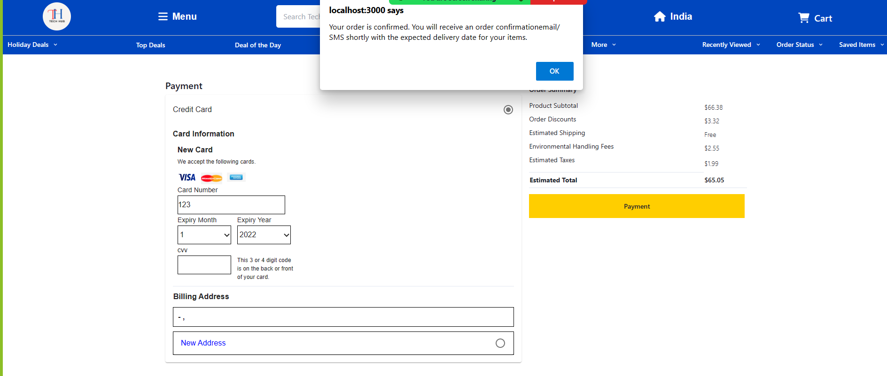

# BestBuy - Clone

## Project : Clone of https://www.bestbuy.com/

## What is BestBuy?

Grab Exciting Deals On Beauty & Cosmetic Products Only On Sephora Official India Store. Shop Unrivalled Range Of Sephora Products. Luxury Beauty And Skincare At Amazing Prices. Online Beauty Store. Largest Beauty Collection.

In this project we have tried to make a clone of https://www.bestbuy.com/ website with our efforts and the technology stack which we learnt till now in masai school.

# Technology Stack Used

In this project we have used the following tech stack.

- HTML
- CSS
- JAVASCRIPT
- ReactJS
- Redux
- EXPRESS
- NODEJS
- MONGODB - Atlas

To make this clone we have used HTMl, CSS and JavaScript for front-end and NodeJS, ExpressJs and MongoDB for back-end.

# Libraries Used

All the images, icons, and links have taken from the original website (https://www.bestbuy.com/)

# Snapshots of Our Project 📸

## Landing Page

This is the landing page of our website. You can see and choose all latest and trending top products from here.

## SignUp Page

You can signup with our website from here .

## Login Page

You can login to our website from here by entering required details.

## Product Page

Here, you can choose a category of products whatever you want.

## Products Page

Here, you can see all the products and whenever you hover on any product you will see ADD TO CART option, bu clicking the button you can add the products to cart.

## SingleProduct Page

Here, you can see all of your products which are added into cart, you can avail the discount by applyling the promocode in respective field and you can remove any product from here also.

## Address Page

In this page you can add your address to where your product should be delivered.

## Checkout Page

## Payment Page

You can see lot of payment options here and you can choose any one of them to pay for your product.

## Summary Page

# Limitations

Home page is fully responsive but remaining pages are not responsive yet , those pages are might not be properly visible on small screen devices.

# End Notes

In this project we have tried to a perfect clone of the original website as much as possible with very limited knowledge of front-end & back-end.
This entire journey of making the project was awesome. We learned lots of things by applying to the real website and it gave us a lot of confidence.

# Team Members 🤝🏻

We have a team of 4 members :

1. Jay Prakash Lohar

2. Vishal Das

3. Akash

4. Rajan Kumar
